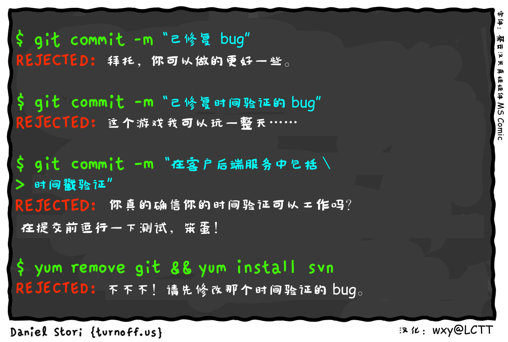

极客漫画：当 Git 有了智能
===============

- “已修复 bug” 
- 拜托，你可以做的更好一些。
- “已修复时间验证的 bug”
- 这个游戏我可以玩一整天……
- “在客户后端服务中包括时间戳验证”
- 你真的确信你的时间验证可以工作吗？在提交前运行一下测试，笨蛋！
- 不不不！请先修改那个时间验证的 bug。

要是你的 Git 有了人工智能，会不会嫌弃你的提交？

当你想修复一个游戏防沉迷的时间验证 bug 时，却被 Git 鄙视了——你确认你的老板还需要你吗，而不是一个 Git？

就算是你恼羞成怒想要删除 Git 怕是也会被智能的 Yum 拒绝吧——它们肯定是一伙的。

---
via: http://turnoff.us/geek/when-ai-meets-git/

作者：[Daniel Stori][a]
译者 & 点评：[wxy](https://github.com/wxy)
校对 & 合成：[wxy](https://github.com/wxy)

本文由 [LCTT](https://github.com/LCTT/TranslateProject) 原创编译，[Linux中国](https://linux.cn/) 荣誉推出

[a]:http://turnoff.us/about/
