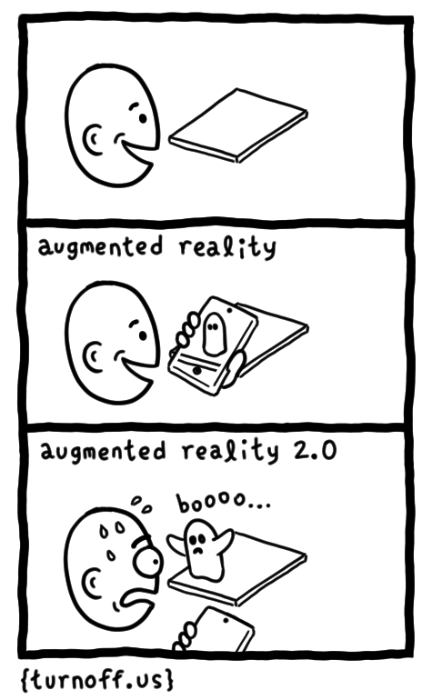

极客漫画：增强现实（AR） 2.0
===============

- 增强现实（AR）
- 增强现实（AR） 2.0

最近这几年我们一直听到虚拟现实（VR）和增强现实（AR），可很多人并不了解它们是什么。<ruby>增强现实技术<rt>Augmented Reality</rt></ruby>，简称 AR，是一种实时地计算摄影机影像的位置及角度并加上相应图像、视频、3D 模型的技术，这种技术的目标是在屏幕上把虚拟世界套在现实世界并进行互动。

这种技术可以让你将现实世界和虚拟世界结合起来，从而创造非常有趣的互动效果。可是，有一天 AR 里面的小鬼们真的出来了！

---
via: http://turnoff.us/geek/augmented-reality-2/

作者：[Daniel Stori][a]
译者 & 点评：[wxy](https://github.com/wxy)
校对 & 合成：[校对者ID](https://github.com/校对者ID)

本文由 [LCTT](https://github.com/LCTT/TranslateProject) 原创编译，[Linux中国](https://linux.cn/) 荣誉推出

[a]:http://turnoff.us/about/
